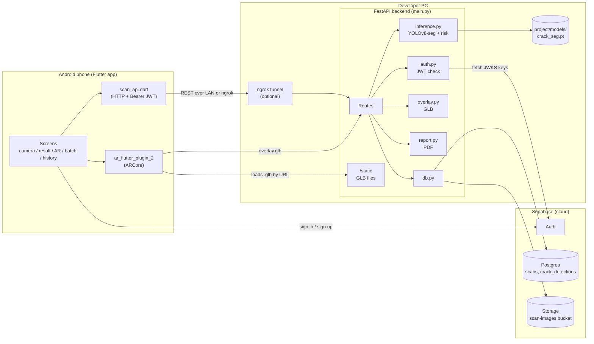
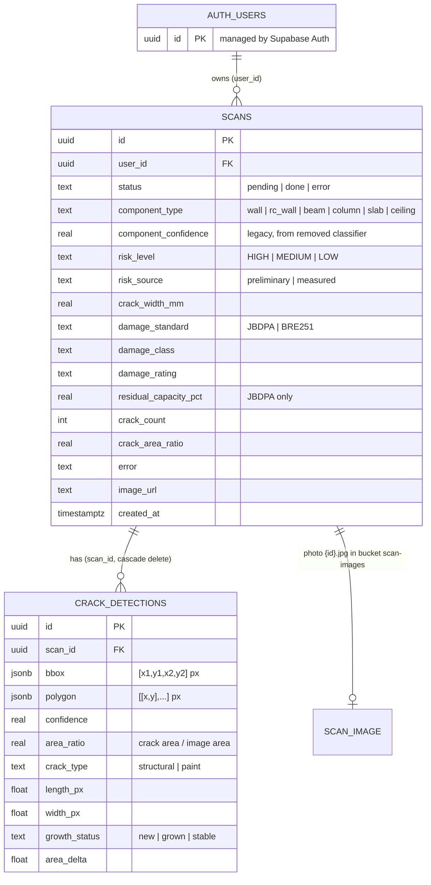
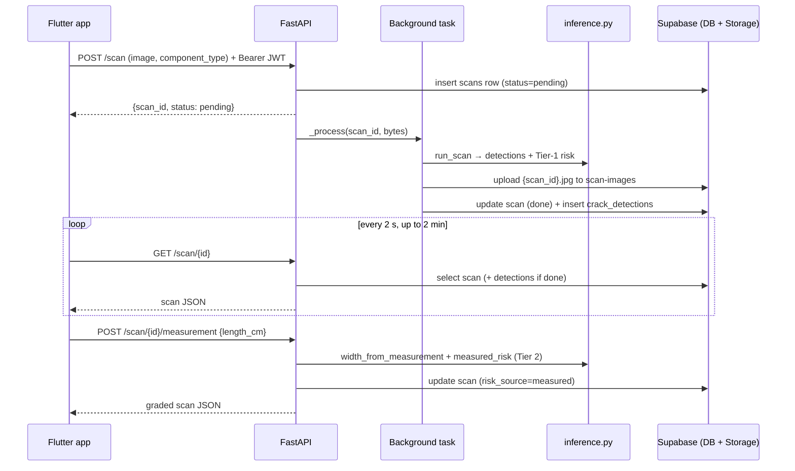

# Structural Vision AR: Project Guide

A newcomer's map of this repository: what it does, how the parts fit, and where to start reading.
Every path below is relative to the repo root. Line numbers were correct when this guide was written (2026-10-06); they will drift as code changes, so search for the function name if a line no longer matches.

---

## 1. Overview

**What it is.** An Android app that checks building elements for cracks. You pick what you are pointing at (a wall, beam, column, slab or ceiling), take a photo, and a server-side AI model finds and outlines the cracks, gives a **risk level** (LOW / MEDIUM / HIGH), and can show the result in **AR** (augmented reality: 3D graphics placed over the live camera view). If you then tell the app how long the crack is, it estimates the crack's **width** and grades it against published engineering standards. It also produces PDF inspection reports and lets you place a 3D building model on an empty site in AR.

**Who it's for.** It is a college major project (SVIT, 4-person team) titled *"Structural Vision AR: Intelligent Structural Health Assessment & Virtual Building Preview Platform"* ([project/structural_vision_ar_context__.md](project/structural_vision_ar_context__.md)). The docs leave the target user open: inspector or student demo ([project/docs/ui_ux_plan.md:99](project/docs/ui_ux_plan.md)).

**The problem it solves.** Spotting and judging cracks by eye is slow and subjective. The app gives a fast, repeatable first opinion, ties it to a standard where possible, and keeps a history per user.

The one-line pitch is in [README.md:3](README.md). The current end-to-end flow (*state the element → photograph → detect → risk → AR → standards grade*) is summarized at [project/docs/model_evolution_report.md:3-4](project/docs/model_evolution_report.md).

---

## 2. Tech stack

| Layer | Technology | Why it's here |
|---|---|---|
| Mobile app | **Flutter / Dart** (`sdk ^3.8.0`, [project/app/pubspec.yaml:7](project/app/pubspec.yaml)) | One codebase for the Android UI. Android is the only target. |
| AR | **ar_flutter_plugin_2** 0.0.3 (wraps Google **ARCore**) | Detects floors/walls, places 3D models (GLB files) in the real world, measures distance between two taps. |
| Camera | **camera**, **image_picker** | Live preview and capture; picking photos from the gallery. |
| App state | **flutter_riverpod** (auth only) + plain `setState` | Riverpod watches the login state; everything else is simple widget state. |
| HTTP | **http** | All calls to the backend. |
| PDF sharing | **printing** | Opens the OS share sheet for PDFs the backend generates. |
| Local storage | **shared_preferences**, **path_provider**, **file_picker** | A few settings; imported custom building models. |
| Backend | **Python + FastAPI**, served by **uvicorn** | REST API that receives photos, runs the model, returns results. |
| ML model | **Ultralytics YOLOv8m-seg** (`crack_seg.pt`) | Instance segmentation: finds each crack and returns its outline (polygon). |
| Image / math | **Pillow**, **NumPy** | Decode images, compute crack geometry and width. |
| PDF | **ReportLab** | Builds the inspection report PDFs ([project/backend/report.py](project/backend/report.py)). |
| 3D files | **trimesh** | Builds the per-scan AR overlay `.glb` and the preset building models. |
| Auth | **Supabase Auth** + **python-jose** | Users sign in with email/password in the app; the backend verifies the resulting JWT. |
| Database | **Supabase Postgres** (via `supabase` Python client) | Stores scans and crack detections. |
| File storage | **Supabase Storage**, bucket `scan-images` | Stores the uploaded photos. |
| Tunnel | **ngrok** | Exposes the backend running on the developer's PC to a phone that isn't on the same Wi-Fi. |
| Training (offline) | Colab / Kaggle GPUs, PyTorch, torchvision | Training the crack model, and the now-removed component classifier. |

---

## 3. Folder structure

```
StructuralVision/
├── README.md                      # Short pitch + generic setup (partly stale, see §16)
├── RUN_GUIDE.md                   # The real day-to-day run instructions (VS Code tasks, ngrok, APK build)
├── TRAINING_FIX_GUIDE.md          # How to fix the "bad image crashes YOLO training" problem on Kaggle
├── architecture_improvements.md   # Design notes (capture flow, model 2 ideas; partly superseded)
├── find_problem_images.py         # Kaggle helper: list multi-frame / huge / unreadable images
├── fix_problem_images.py          # Kaggle helper: repair or remove those images
├── fix_local_dataset.py           # Copy merged dataset, force every label to class 0 "crack"
├── TODO.md                        # Personal notes
├── StructuralVisionAR_*.docx/pdf  # Draft paper and team scripts
├── docs/superpowers/specs/        # Burst-capture design spec
└── project/
    ├── app/                       # ── Flutter Android app ──
    │   ├── pubspec.yaml           # Dart dependencies
    │   ├── lib/
    │   │   ├── main.dart          # Entry point: init config + Supabase, auth gate
    │   │   ├── config.dart        # Backend URL, Supabase URL/key (dart-defines + runtime override)
    │   │   ├── scan_api.dart      # Every backend REST call lives here
    │   │   ├── models.dart        # ScanResult / CrackDetection (mirror backend JSON)
    │   │   ├── building_catalog.dart  # Loads the AR building list from the backend
    │   │   ├── theme.dart         # Colours, text styles
    │   │   ├── ar_harness.dart    # Dev-only entry point that skips login and opens Building AR
    │   │   └── screens/           # One file per screen (camera, result, AR, batch, history, ...)
    │   ├── test/                  # Flutter unit + widget tests
    │   └── android/               # Android build config, manifest (permissions, ARCore requirement)
    ├── backend/                   # ── FastAPI server ──
    │   ├── main.py                # App, startup, all routes
    │   ├── inference.py           # YOLO model, crack geometry, risk scoring, width measurement
    │   ├── auth.py                # Verifies Supabase JWTs
    │   ├── db.py                  # Supabase table + storage helpers
    │   ├── overlay.py             # Builds the per-scan AR overlay (.glb)
    │   ├── report.py              # Builds PDF reports
    │   ├── schema.sql             # Database tables + row-level security; run once in Supabase
    │   ├── check_setup.py         # Pre-flight checker (packages, .env, Supabase, model file, port)
    │   ├── make_buildings.py      # Regenerates the preset AR building models + manifest
    │   ├── test_risk.py, test_report.py  # Backend tests (plain scripts)
    │   ├── .env.example           # Env var template
    │   └── static/                # Served at /static: marker GLBs, building GLBs + manifest.json
    ├── models/                    # Model weights (crack_seg.pt). NOT in git.
    ├── demo_kit/                  # 6 curated crack photos with known expected risk levels
    ├── docs/                      # Plans, model evolution report, runbooks, checklists
    ├── prepare_datasets.py        # Builds training folders for model 1 and model 2
    ├── download_column_images.py  # Scrapes column photos for model 2
    ├── zip_dataset.py             # Zips the crack dataset for Colab
    ├── train_model1_crack.ipynb   # Colab notebook: train the crack segmenter
    ├── train_model2_classifier.py # Train the component classifier (now unused)
    └── export_model2_onnx.py      # Export that classifier to ONNX (now unused)
```

Not in git but present on the author's machine (all gitignored, [.gitignore](.gitignore)): `datasets/`, `kaggle_tomo/` (v3/v4 Kaggle training), `tools/` (ngrok, JDK 17), `.vscode/` (the run tasks RUN_GUIDE refers to), `project/models/`, `.env`, `project/app/dart_defines.env`.

---

## 4. Architecture

Three parts: the **phone app**, the **FastAPI backend** (runs on a PC), and **Supabase** (hosted auth, database and file storage). The app never talks to the Supabase database directly. It only uses Supabase for login, then sends the login token to the backend.



**Layers inside the backend:**
- `main.py` is a thin routing layer that orchestrates everything.
- `inference.py` is pure logic (model + maths) with no web or DB code.
- `db.py` is the only module that talks to Supabase.
- `overlay.py` and `report.py` turn stored results into files (GLB, PDF).

**Layers inside the app:**
- `screens/*` are UI.
- `scan_api.dart` is the only file that calls the scan endpoints.
- `models.dart` is the data shapes.
- `config.dart` holds the settings.

---

## 5. Entry points and startup flow

### Backend ([project/backend/main.py](project/backend/main.py))

Started with `uvicorn main:app --host 0.0.0.0 --port 8000` from `project/backend/`.

1. **Lines 14-21:** reads `.env` by hand before anything else is imported, using `os.environ.setdefault`, so real environment variables win over `.env`.
2. **Lines 23-37:** imports `inference`, `auth`, `db`, `overlay`, `report`.
3. **Line 52:** creates `app = FastAPI(..., lifespan=lifespan)`.
4. **Line 53:** mounts `static/` at `/static`. The path is relative to the *working directory*, so you must launch from `project/backend/`.
5. **`lifespan` (lines 40-49) runs once at boot:**
   - `load_models()` (line 42) loads `project/models/crack_seg.pt` into memory. If the file is missing, startup fails.
   - It probes Supabase with a 1-row select on `scans` and prints `Supabase: connected OK` or `!!! SUPABASE NOT CONNECTED`. It keeps running either way.
   - `db.ensure_bucket()` (line 48) creates the `scan-images` bucket if needed.
6. There is no CORS or other middleware. FastAPI's auto-docs at `/docs` stay on, and RUN_GUIDE uses them as the health check.

### App ([project/app/lib/main.dart](project/app/lib/main.dart))

1. `WidgetsFlutterBinding.ensureInitialized()`, then system bar colours (lines 12-18).
2. `AppConfig.load()` (line 19) reads a saved backend-URL override from SharedPreferences.
3. `Supabase.initialize(url, publishableKey)` (lines 20-23). Both values come from `--dart-define` at build time.
4. `runApp(ProviderScope(child: App()))` (line 24).
5. `App` (lines 30-44) watches `authStateProvider`, a stream of login events. If there is a session, `home` is `CameraScreen`; otherwise `LoginScreen`. Signing in or out rebuilds `App` and swaps the screen automatically. No navigation code is involved.

A second, dev-only entry point, [project/app/lib/ar_harness.dart](project/app/lib/ar_harness.dart), skips Supabase and opens the Building AR screen directly, which is useful on an emulator:
```bash
flutter run -t lib/ar_harness.dart --dart-define=DEFAULT_API_BASE=http://10.0.2.2:8000
```

---

## 6. Core features, walked through

### 6.1 Login
1. In `LoginScreen`, `_run` ([project/app/lib/screens/login_screen.dart:22-50](project/app/lib/screens/login_screen.dart)) checks the fields locally first: non-empty, an `@` in the email, password at least 6 characters. An empty sign-up would otherwise become an anonymous Supabase sign-in.
2. It then calls `auth.signInWithPassword` (line 237) or `auth.signUp` (line 56). If email confirmation is on, sign-up shows a "check your email" notice.
3. Supabase stores the session, and the auth stream rebuilds `App`, which now shows `CameraScreen`.
4. The "Backend server" button on the same screen (lines 64-102) lets you type a backend URL (e.g. an ngrok URL) and saves it with `AppConfig.setApiBase`.

### 6.2 Single scan (photo → result)
**UI**
1. In [camera_screen.dart](project/app/lib/screens/camera_screen.dart), the user picks a component through `ComponentSelectSheet`. The choice is remembered in SharedPreferences under `last_component`.
2. The shutter calls `_scan` (lines 144-175), which calls `takePicture`.
3. `_analyze` (lines 348-361) then calls `scanApi.submitScan(bytes, componentType)` followed by `scanApi.waitForResult(id)`.

**API**
4. `submitScan` ([project/app/lib/scan_api.dart:30-54](project/app/lib/scan_api.dart)) sends `POST /scan` as a multipart form: file `image`, plus `component_type` and optionally `prev_scan_id`. It has a 30 s timeout and retries once.

**Backend**
5. `POST /scan` ([project/backend/main.py:74-87](project/backend/main.py)):
   - Checks the JWT (`Depends(current_user)`).
   - `db.create_scan` inserts a `pending` row.
   - Schedules `_process` as a FastAPI **background task**, meaning work that runs after the response is sent.
   - Returns `{scan_id, status:"pending"}` immediately.

**Logic**
6. `_process` (lines 56-71) runs `inference.run_scan(bytes, component_type)` ([inference.py:444-460](project/backend/inference.py)):
   - `detect_cracks` (lines 39-68) runs `yolo.predict(imgsz=1024, conf=0.4, iou=0.45)`.
   - For each mask it computes the polygon, bbox, `area_ratio`, `length_px`, `width_px` and `crack_type` (structural or paint, lines 106-123).
   - It drops blobs that aren't elongated enough (`MIN_ELONGATION = 4.0`, line 80).
   - `compute_risk` produces the **Tier-1** preliminary risk (lines 181-197):
     ```python
     DI = sum(area_ratio * CF[component] * SF[crack_type])
     # CF: column/rc_wall 1.5, beam 1.3, slab 1.0, wall 0.8, ceiling 0.2;  SF: structural 1.0, paint 0.2
     HIGH if DI >= 0.07 else MEDIUM if DI >= 0.03 else LOW
     ```
   - If `prev_scan_id` was sent, `diff_detections` (lines 139-158) tags each crack `new`, `grown` (more than 10% area increase) or `stable`.

**Database**
7. `db.upload_image` stores the photo in the `scan-images` bucket. `db.finish_scan` updates the row to `done` and bulk-inserts the `crack_detections` rows. Any exception calls `db.fail_scan`, which sets `status='error'`.

**Response**
8. Meanwhile the app polls `GET /scan/{id}` every 2 s for up to 2 min (`waitForResult`, `scan_api.dart:141-157`). Once `status == done`, the response includes `detections`.

**UI**
9. `ResultScreen` ([result_screen.dart](project/app/lib/screens/result_screen.dart)) shows:
   - the photo, with `_OverlayPainter` drawing each crack polygon (lines 511-550); tap a crack to see its confidence;
   - a risk badge and stats;
   - the "Measure in AR", "Enter length", "View in AR" and "Share report" buttons.

### 6.3 Measurement and standards grading (Tier 2)
1. The user supplies the crack's real length in one of two ways:
   - "Enter length" (`_enterLengthManually`, result_screen.dart:40-100, accepts 0-1000 cm).
   - Two taps in AR: `ArScreen` computes the distance between the taps × 100 cm.
2. The app sends `POST /scan/{id}/measurement` with `{"length_cm": x}` (`scan_api.dart:78-99`).
3. The backend route ([main.py:107-151](project/backend/main.py)) runs these steps:
   - 404 if the scan doesn't exist; 409 if it isn't `done`.
   - Downloads the photo.
   - `implausible_measurement` rejects lengths implying the photo is narrower than 0.05 m or wider than 15 m, with a **422**. The app shows that reason as a toast.
   - `width_from_measurement` ([inference.py](project/backend/inference.py), lines ~260-441) sets the scale from the largest crack: `mm_per_px = length_cm*10/length_px`.
   - It then measures the true width from pixel brightness across the crack (`profile_width_px`, an "equivalent width" method that works below 1 pixel). The mask width is only an upper bound, because masks are much fatter than real hairline cracks.
   - `measured_risk(width_mm, component, crack_type)` (lines 239-257) grades the width:
     - **JBDPA** for RC members (column / beam / slab / rc_wall): class I-IV, residual capacity %.
     - **BRE Digest 251** for masonry `wall`: category 0-5.
     - `ceiling` and paint cracks are rated "Cosmetic" and LOW.
   - `db.set_measurement` saves `risk_source='measured'` and the grade fields.
   - The overlay cache is cleared so the AR colour updates.
4. The app replaces its `ScanResult` with the response. `gradeSummary` ([models.dart:116-124](project/app/lib/models.dart)) prints e.g. `JBDPA class II · Moderate · 60% capacity`.

### 6.4 AR view of a scan
- `ArScreen` ([ar_screen.dart](project/app/lib/screens/ar_screen.dart)) opens an ARCore view and waits for a plane (a detected flat surface).
- **On tap** (`_onTap`, lines 176-234), it anchors one 3D node:
  - If the scan has cracks: `GET /scan/{id}/overlay.glb`, built by [overlay.py](project/backend/overlay.py). This is a 1 m flat quad textured with the photo and coloured crack polygons.
  - Otherwise: a coloured pin, `/static/marker_{low|medium|high}.glb`.
- **Wall mode** (vertical planes) is opt-in. A crash flag stored in SharedPreferences (lines 49-58, 94-120) hides it permanently on phones where it crashed ARCore.
- **Back** returns the updated result to `ResultScreen` (lines 276-280).

### 6.5 Burst, multi-shot and gallery → batch
All three end up in `BatchScreen`:
- **"Video" burst** (`_toggleRecording`, camera_screen.dart:207-262): this is not real video. It takes a still every 2.5 s, up to 8, all with the same component.
- **Multi-capture** (`_toggleMulti` / `_finishMulti`, lines 274-304): manual shots, up to 12, each with its own component.
- **Gallery** (`_pickFromGallery`, lines 177-204): one image goes to the single-scan flow; more than one goes to the batch.

Each photo is uploaded one after another with `submitScan`. [batch_screen.dart](project/app/lib/screens/batch_screen.dart) then polls all ids in parallel, shows one card per photo, and offers a combined report through `GET /report?ids=a,b,c`.

### 6.6 History
[history_screen.dart](project/app/lib/screens/history_screen.dart) works like this:
1. Calls `GET /scans`, which returns your last 100 scans, newest first ([main.py:90-92](project/backend/main.py) → `db.list_scans`).
2. Tapping a `done` scan calls `GET /scan/{id}` and downloads `image_url`.
3. It then opens `ResultScreen`.

### 6.7 PDF reports
**Single scan.** `GET /scan/{id}/report` ([main.py:209-222](project/backend/main.py)) calls `report.build_pdf`, which produces one A4 page with:
- the photo with cracks drawn on it;
- a risk badge and stats;
- a **maintenance window** (HIGH 0-6 months, MEDIUM 6-24 months, LOW 2-5 years);
- the standard cited, if the scan was measured.

**Batch.** `GET /report?ids=…` (lines 180-206) calls `build_batch_pdf`, which produces a summary page (worst risk plus one table row per photo) followed by one page per scan.

**In the app.** Reports are opened through `Printing.sharePdf`.

### 6.8 Building AR (site preview)
1. The apartment icon on the camera screen opens [site_preview_screen.dart](project/app/lib/screens/site_preview_screen.dart).
2. `BuildingCatalog.fetch()` ([building_catalog.dart:63-76](project/app/lib/building_catalog.dart)) loads `/static/buildings/manifest.json`. That manifest is generated by [make_buildings.py](project/backend/make_buildings.py) and lists house, apartment, office and tower. If the fetch fails, the app falls back to a 20 m demo tower.
3. Two size modes:
   - **Room mode** (default) shows a miniature 0.2-1.5 m model on a table.
   - **Site mode** shows the building at its real size.
4. Users can import their own `.glb` ([building_select_sheet.dart:18-77](project/app/lib/screens/building_select_sheet.dart)). It is copied into the app's documents folder and the user is asked for its real size in metres.

---

## 7. Data model

Defined in [project/backend/schema.sql](project/backend/schema.sql). Run it once in the Supabase SQL editor.



- **Row-level security** (RLS, Postgres rules that limit which rows a user can see) is on for both tables: you only see rows where `auth.uid() = user_id` (schema.sql:47-56). The backend, however, uses the **service key**, which bypasses RLS. It enforces ownership in code instead, with `.eq("user_id", user_id)` in `db.get_scan` ([db.py:105-106](project/backend/db.py)).
- **App-side mirrors:** `ScanResult` and `CrackDetection` in [project/app/lib/models.dart](project/app/lib/models.dart). Their JSON keys match the column names, plus four values computed by the measurement route: `width_mm_upper`, `width_uncertain`, `width_resolved` and `mm_per_px`.

---

## 8. APIs and routes

All routes live in [project/backend/main.py](project/backend/main.py). "Auth" means the request needs an `Authorization: Bearer <Supabase access token>` header. Interactive docs are at `http://localhost:8000/docs`.

| Method and path | Line | Auth | Input | Output |
|---|---|---|---|---|
| `POST /scan` | 74 | yes | multipart: `image` (file); form: `component_type`, `prev_scan_id` (optional) | `{"scan_id", "status":"pending"}`; processing continues in the background |
| `GET /scans` | 90 | yes | none | list of your `scans` rows, newest first, max 100, without detections |
| `GET /scan/{scan_id}` | 95 | yes (owner only) | path id | scan row, plus `detections` once `status=="done"`; 404 if not yours or not found |
| `POST /scan/{scan_id}/measurement` | 107 | yes | JSON `{"length_cm": 0 < x ≤ 1000}` | updated scan with grade + `width_mm_upper`, `width_uncertain`, `width_resolved`, `mm_per_px`; 409 if not done; 422 if implausible or nothing measurable |
| `GET /scan/{scan_id}/overlay.glb` | 154 | **no**, because ARCore loads it by URL and can't send headers | path id | `model/gltf-binary` |
| `GET /report?ids=a,b,c` | 180 | yes | comma-separated ids, in capture order | PDF `inspection_<id8>.pdf`; 400 if no ids; 404 if none have photos |
| `GET /scan/{scan_id}/report` | 209 | yes | path id | PDF `scan_<id8>.pdf` |
| `GET /static/*` | 53 | no | file path | marker and building GLBs, `buildings/manifest.json`, optionally the APK |

---

## 9. State management and data flow

**In the app:**
- Riverpod holds exactly one provider: `authStateProvider` ([main.dart:27](project/app/lib/main.dart)).
- Everything else is `StatefulWidget` + `setState`. Data is passed between screens through constructor arguments, and results come back via `Navigator.pop(result)`.
- Shared services are global singletons: `scanApi` ([scan_api.dart:160](project/app/lib/scan_api.dart)), plus the static classes `AppConfig` and `BuildingCatalog`.
- **There is no local scan cache.** History always comes from the server.

**Server state** lives in Supabase. The flow is asynchronous: upload, then a background job, then polling.



**Persisted on the device (SharedPreferences):**

| Key | Purpose |
|---|---|
| `api_base_override` | Backend URL set at runtime |
| `last_component` | Last component picked |
| `ar_wall_pending` | Wall-mode crash detection |
| `ar_wall_blocked` | Wall mode disabled on this phone |

Imported building models are also kept on the device, as `custom_*.glb` files.

---

## 10. Auth and security

**Login**
- Supabase Auth with email and password, done in the app.
- The app attaches the session's `accessToken` to every scan call (`_authHeaders`, [scan_api.dart:21-25](project/app/lib/scan_api.dart)).

**Token check** ([project/backend/auth.py](project/backend/auth.py))
1. Downloads Supabase's public keys (**JWKS**, a JSON list of signing keys) from `SUPABASE_URL/auth/v1/.well-known/jwks.json`, cached for 1 hour.
2. Picks the key matching the token's `kid`.
3. Verifies the token with `audience="authenticated"`.
4. Returns `claims["sub"]` as the user id.

No shared secret is used, and there is no switch to turn auth off.

Failure responses:
- A bad token gets a 401.
- A missing header gets a 422, FastAPI's error for a missing required field.
- A JWKS download failure is not caught, so it probably surfaces as a 500.

**Permissions**
- The backend talks to Supabase with the **service key**, which has full access.
- Per-user access is enforced in Python: `get_scan` filters by `user_id`, and `list_scans` filters by user.

**Deliberately public**
- `/scan/{id}/overlay.glb`.
- `/static/*`.
- The `scan-images` bucket. Its photo URLs are public, and the only protection is that ids are random UUIDs.
- `prev_scan_id` is loaded without an ownership check ([main.py:61](project/backend/main.py)).

**Secrets**
- Backend: `project/backend/.env`.
- App: `project/app/dart_defines.env`.
- Both are gitignored (`*.env`). The app only ever holds the **publishable** (public) key.

**Known leak:** the docs contain a plaintext test-account login, at `RUN_GUIDE.md:106` and in three files under `project/docs/`. Rotate that password if the repo is ever shared.

---

## 11. Configuration and environment

### Backend env vars (`project/backend/.env`, template [.env.example](project/backend/.env.example))

| Variable | Read at | Effect |
|---|---|---|
| `SUPABASE_URL` | `db.py:19`, `auth.py:22` | Supabase project URL; used for the DB client and the JWKS URL. Required (a missing value raises `KeyError`). |
| `SUPABASE_SERVICE_KEY` | `db.py:20` | Service-role (`sb_secret_…`) key. Full DB/storage access. Required. |
| `SUPABASE_JWT_SECRET` | **nowhere** | Listed in `.env.example` and README but unused. Leftover from before JWKS. |

### App build-time values (`--dart-define`, [project/app/lib/config.dart](project/app/lib/config.dart))

| Key | Default | Effect |
|---|---|---|
| `SUPABASE_URL` | `''` | Supabase project URL |
| `SUPABASE_ANON_KEY` | `''` | Supabase publishable key (`sb_publishable_…`; the legacy anon key is disabled, per RUN_GUIDE.md:172) |
| `DEFAULT_API_BASE` | `http://localhost:8000` | Backend URL. Can be overridden at runtime from the login screen. |

Usually supplied all at once with `--dart-define-from-file=dart_defines.env`.

### Tunable constants (in code, not env)

| Constant | Where | Value |
|---|---|---|
| YOLO confidence / IoU / input size | `inference.py:48`, `:266` | 0.4 / 0.45 / 1024 |
| Minimum elongation | `inference.py:80` | 4.0 |
| Tier-1 thresholds and factors | `inference.py:181-197` | DI ≥ 0.03 MEDIUM, ≥ 0.07 HIGH |
| Polling | `scan_api.dart:141-157` | every 2 s, 2 min max |
| Burst | `camera_screen.dart:26-28` | 1 s delay, every 2.5 s, 8 shots |
| Multi-capture | `camera_screen.dart:29` | max 12 shots |
| Camera resolution | `camera_screen.dart:120-121` | `ResolutionPreset.max` |
| Model file | `inference.py:21-22` | `project/models/crack_seg.pt`. Swap the file and restart; no code change needed. |

### Android ([build.gradle.kts](project/app/android/app/build.gradle.kts), [AndroidManifest.xml](project/app/android/app/src/main/AndroidManifest.xml))

- **SDK and app id:** `minSdk 28`, required by the AR plugin. `applicationId com.structuralvision.structural_vision_ar`.
- **Permissions:** `INTERNET`, `CAMERA`.
- **ARCore:** `camera.ar` is marked *required*, so the app only installs on ARCore phones.
- **Plain HTTP:** `usesCleartextTraffic="true"`, so a LAN backend over `http://` works.

---

## 12. Running it locally

### What you need that isn't in git
- **Model weights:** `project/models/crack_seg.pt`. The README mentions a "shared drive link", but no link is documented, so ask the team.
- **A Supabase project:**
  1. Run [schema.sql](project/backend/schema.sql) in its SQL editor.
  2. Copy the URL, the service key and the publishable key.
- **Tools:** Python 3.10+ (the author uses 3.14), Flutter 3.32+, Android SDK, JDK 17 (Java 8 is too old), and optionally ngrok.

### Backend
```bash
cd project/backend
python -m venv .venv
```
```bash
.venv\Scripts\activate
```
```bash
pip install -r requirements.txt
```
Fill in `.env` (copy it from `.env.example`), then:
```bash
python check_setup.py
```
```bash
uvicorn main:app --host 0.0.0.0 --port 8000
```

Wait for `Supabase: connected OK` and `Application startup complete`, then open `http://localhost:8000/docs`.

### App
Create `project/app/dart_defines.env` with these keys:
```
SUPABASE_URL=...
SUPABASE_ANON_KEY=...
DEFAULT_API_BASE=http://<your PC's LAN IP>:8000
```
On an emulator, use `http://10.0.2.2:8000` as the backend URL.

```bash
cd project/app
flutter pub get
```
```bash
flutter run --dart-define-from-file=dart_defines.env
```

### Phone off your Wi-Fi (ngrok)
```bash
ngrok http 8000
```
Then on the phone, use **Backend server** on the login screen to paste the https URL. No rebuild needed.

### Release APK (RUN_GUIDE.md:134-139)
```bash
flutter build apk --release --dart-define-from-file=dart_defines.env
```
- Set `JAVA_HOME` to JDK 17 first.
- Output: `project/app/build/app/outputs/flutter-apk/app-release.apk`.
- You only need to rebuild for Flutter code changes or Supabase URL/key changes. A model swap or IP change does not need a rebuild ([RUN_GUIDE.md:120-129](RUN_GUIDE.md)).

### Model smoke test on the demo photos
```bash
cd project/backend
python inference.py
```

---

## 13. Testing

**Backend** (plain scripts with `test_*` functions; pytest would also collect them, but it isn't installed):
- [test_risk.py](project/backend/test_risk.py) covers:
  - JBDPA and BRE 251 class boundaries;
  - ceiling and paint cracks grading LOW;
  - width measured from the photo vs the mask, including sub-pixel cracks, using synthetic images;
  - rejection of implausible lengths;
  - the elongation filter.
- [test_report.py](project/backend/test_report.py) covers:
  - batch PDF page count;
  - the worst-risk badge;
  - rows for failed scans;
  - labels.

  `test_measured_scan_report_shows_width_range` covers the measured-report path.
- Neither needs the model or Supabase.

```bash
cd project/backend
python test_risk.py
```
```bash
python test_report.py
```
Self-checks also run on `python overlay.py` and `python make_buildings.py`.

**App** ([project/app/test/](project/app/test/)): pure unit and widget tests, no device or backend needed. Run from `project/app` (the contract test reads its fixture by relative path).
- `models_test.dart`: JSON parsing and grade summaries.
- `building_catalog_test.dart`: manifest parsing and scale per mode.
- `building_select_sheet_test.dart`: picking a building from the sheet.
- `result_screen_test.dart`: no overflow at Vivo Y200 screen size.
- `live_contract_test.dart`: parses a real backend response captured 2026-07-15 ([live_scan_result.json](project/app/test/live_scan_result.json)).

```bash
flutter test
```
`result_screen_test.dart:59` still looks for a "Measure crack" button that was renamed to "Measure in AR", so expect that case to fail (not run to confirm).

**Manual:** [project/docs/device-test-checklist.md](project/docs/device-test-checklist.md), and the demo kit regression in [project/demo_kit/README.md](project/demo_kit/README.md).

---

## 14. Deployment

There is no cloud deployment, CI/CD, Docker or Procfile in the repo.

- **Backend:** runs on the developer's Windows PC. Phones reach it over the LAN (`http://<LAN IP>:8000`, Windows firewall rule for port 8000) or via an **ngrok** static domain. The PC must stay on ([project/docs/remote-demo-runbook.md](project/docs/remote-demo-runbook.md)).
- **Supabase:** hosted free tier. Free projects pause after about 7 days of inactivity ([RUN_GUIDE.md:161](RUN_GUIDE.md)).
- **App:** a release APK, installed with `adb install -r` or downloaded from `/static/structural_vision_ar.apk` if it has been copied there (gitignored). Release builds are still signed with the debug key ([build.gradle.kts:35-37](project/app/android/app/build.gradle.kts)).
- **Run tasks:** the author uses VS Code tasks ("1. Check setup", "2. Start backend", "3. ngrok tunnel", "APK: build release", …), but `.vscode/` is gitignored, so a fresh clone won't have them.

---

## 15. Key files to read first

1. [RUN_GUIDE.md](RUN_GUIDE.md): how the system is actually run day to day, and what each piece needs.
2. [project/backend/main.py](project/backend/main.py): about 220 lines that show every route and the whole request lifecycle.
3. [project/backend/inference.py](project/backend/inference.py): the core of the system (detection, risk tiers, width measurement). Read `run_scan`, `compute_risk` and `measured_risk` first.
4. [project/backend/schema.sql](project/backend/schema.sql): the data model, in one page.
5. [project/app/lib/scan_api.dart](project/app/lib/scan_api.dart) and [models.dart](project/app/lib/models.dart): the app's whole contract with the backend.
6. [project/app/lib/screens/camera_screen.dart](project/app/lib/screens/camera_screen.dart): where every user flow starts.
7. [project/app/lib/screens/result_screen.dart](project/app/lib/screens/result_screen.dart): how results are shown, and the gateway to measurement and AR.
8. [project/docs/model_evolution_report.md](project/docs/model_evolution_report.md): why the model and thresholds are what they are (v1→v4, rejected ideas, hairline limits).
9. [project/backend/auth.py](project/backend/auth.py) and [db.py](project/backend/db.py): short, and they explain security and storage.
10. [project/app/lib/screens/ar_screen.dart](project/app/lib/screens/ar_screen.dart): AR placement, measuring and the crash guards.

---

## 16. Gotchas and tech debt

**Confirmed bugs**
- **A stale widget test:** `result_screen_test.dart:59` expects "Measure crack".

**Fragile or surprising**
- **Working directory matters.** `StaticFiles(directory="static")` and `make_buildings.py` assume you start from `project/backend/`.
- **Retries can duplicate scans.** `submitScan` retries on *any* exception, including 4xx/5xx, and a retry after a timeout can create a duplicate scan ([scan_api.dart:50-52](project/app/lib/scan_api.dart)).
- **No validation of `component_type` in Python.** A bad value only fails at the DB check constraint, and the scan ends up as `error`.
- **JWKS cache isn't refreshed** on an unknown `kid`. After Supabase rotates keys you can get up to an hour of 401s.
- **`schema.sql` isn't re-runnable**, because `create policy` has no `if not exists`.
- **The overlay GLB is always 1 m wide**, not the crack's real size (`ponytail:` note in [ar_screen.dart:222-223](project/app/lib/screens/ar_screen.dart)).
- **Hairline cracks:**
  - The model misses about 30% of cracks: hairline, low contrast or unlabeled ([model_evolution_report.md:79-84](project/docs/model_evolution_report.md)).
  - `project/demo_kit/missed.jpeg` (untracked) is a known miss.
  - Tier-1 risk depends on how close you stand, because area ratio changes with framing.

**Device-specific hacks (Vivo Y200 / V2307, ARCore 1.54)**
- **Camera released before AR.** The camera is disposed before every AR push, otherwise there is a SIGSEGV in `libarcore_c.so` (camera_screen.dart:323).
- **Feature points hidden** once a plane is found, to keep the frame rate up.
- **Wall mode** is guarded by a persistent crash flag.
- **`ResolutionPreset.max`** is used because lower presets gave 720p on the vivo. Photos are 3-5 MB with no downscaling.

**Doc drift**
- **README.md**
  - Says `models/` holds "configs" (it holds gitignored weights).
  - Lists `SUPABASE_JWT_SECRET`, which is unused.
  - Points to a shared-drive link that isn't documented.
- **[project/app/README.md](project/app/README.md)** is the untouched Flutter template, yet `config.dart:11` tells you to read it.
- **Old paths in runbooks.** `walkthrough-guide.md`, `device-test-checklist.md` and `remote-demo-runbook.md` use an old path `F:\Major_project\...` and an obsolete `.env` sourcing step.
- **Model 2.** [architecture_improvements.md](architecture_improvements.md) still describes Model 2 (the component classifier) as active. It was removed 2026-09-08; the user's pick is now authoritative ([inference.py:8-11](project/backend/inference.py)).
- **Model v1 architecture.** v1 is called YOLOv8s-seg in the report but YOLOv8n-seg in the notebook and `prepare_datasets.py`.

**Repo hygiene**
- `pubspec.lock` is gitignored, so app builds aren't reproducible.
- Release builds are signed with the debug key.
- Plaintext test credentials appear in the docs (§10).
- `Roboto`/`RobotoMono` are referenced in `theme.dart` but not bundled.

---

## 17. Glossary

| Term | Meaning |
|---|---|
| **Scan** | One uploaded photo and its analysis (one `scans` row). |
| **Detection** | One crack found in a scan: polygon, bbox and stats (one `crack_detections` row). |
| **Component** | The building element photographed: `wall` (brick/masonry), `rc_wall` (reinforced-concrete wall), `beam`, `column`, `slab`, `ceiling`. The user chooses it. |
| **Model 1** | The crack segmenter, YOLOv8m-seg. The deployed version is **v4**, fine-tuned from v2 on 9,816 images. |
| **Model 2** | MobileNetV3-Small component classifier. Removed; its code and docs remain. |
| **YOLO / seg** | "You Only Look Once", a fast object detector. The `-seg` variant also outputs a pixel mask per object. |
| **conf / iou / imgsz** | Minimum confidence to keep a detection (0.4); the overlap threshold for merging duplicates (0.45); the size images are resized to for the model (1024). |
| **mAP50** | Mean average precision at 50% overlap, the standard detection metric. The team judges models by **image-level accuracy** instead (did it find a crack in a cracked photo?). |
| **area_ratio** | Crack polygon area ÷ image area. |
| **Elongation** | Crack length ÷ width. Below 4 the blob is discarded as probably not a crack. |
| **crack_type** | `structural` or `paint` (cosmetic), from a shape heuristic. |
| **growth_status** | `new` / `grown` / `stable` relative to a previous scan (`prev_scan_id`). |
| **Tier 1 / preliminary risk** | Risk from the **Damage Index (DI)** = Σ area_ratio × CF × SF. An in-house heuristic, not a standard. |
| **CF / SF** | Component factor (how critical the element is) and surface factor (structural vs paint). |
| **Tier 2 / measured risk** | Risk from the measured crack width graded by a published standard, after the user gives a length. |
| **JBDPA** | Japan Building Disaster Prevention Association damage guideline for RC members: class I-IV, residual capacity %. |
| **BRE 251** | UK Building Research Establishment Digest 251, crack categories 0-5 for masonry. |
| **Residual capacity (R, η)** | Estimated share of seismic capacity left after damage (JBDPA). |
| **FWHM / equivalent width** | Two ways of measuring crack width from the brightness profile across it. FWHM bottoms out at about 3 px; equivalent width works below one pixel. |
| **mm_per_px** | Scale derived from the user's length: length_cm × 10 / length_px. |
| **Maintenance window** | Recommended timeframe on the report: Immediate 0-6 months, Short-term 6-24 months, Long-term 2-5 years. |
| **GLB** | Binary glTF, a single-file 3D model format that ARCore loads. |
| **Overlay GLB** | Per-scan 3D quad textured with the photo and coloured cracks (`/scan/{id}/overlay.glb`). |
| **Marker** | Coloured pin GLB shown in AR when a scan has no cracks. |
| **Plane** | A flat surface ARCore has detected (floor, table, wall). |
| **Room / Site mode** | Building AR as a tabletop miniature vs at real size. |
| **Burst capture** | The camera's "Video" mode: timed stills (8 × 2.5 s), not video. |
| **Demo kit** | Six labelled photos (`high/medium/low_1/2.jpg`) used for demos and regression checks after a model swap. |
| **JWT / JWKS** | JSON Web Token (the login token); JSON Web Key Set (the public keys used to verify it). |
| **RLS** | Postgres Row-Level Security. |
| **dart-define** | Flutter compile-time constant passed on the command line. |
| **`ponytail:` comment** | Marks a deliberate shortcut with a known limit and an upgrade path. |

---

## 18. Suggested learning path

Do these in order. Each step should take under an hour.

1. **Get the backend up.**
   - Follow §12, run `python check_setup.py`, start uvicorn and open `/docs`.
   - *Exercise:* in `lifespan` ([main.py:41](project/backend/main.py)), add `print("routes:", [r.path for r in app.routes])`, restart, and match the output to the table in §8.
2. **Run the model without the web layer.**
   - Run `python inference.py`. It scans `project/demo_kit/*.jpg`.
   - *Exercise:* in `detect_cracks` ([inference.py:48](project/backend/inference.py)), temporarily change `conf=0.4` to `0.25` and rerun. Count how many extra detections appear, and see which ones the elongation filter (`_too_stubby`, line ~80) removes. Revert afterwards.
3. **Understand risk scoring.**
   - Read `compute_risk` and `measured_risk`, then run `python test_risk.py`.
   - *Exercise:* write a three-line script that calls `measured_risk(0.5, "column", "structural")` and `measured_risk(0.5, "wall", "structural")`. Explain why the same width gives different standards and classes.
4. **Trace one request through the database.**
   - In `/docs`, click *Authorize* and paste a JWT. You can get one by adding `print(Supabase.instance.client.auth.currentSession?.accessToken)` in the app after login.
   - Call `POST /scan` with a demo-kit photo, then poll `GET /scan/{id}`.
   - *Exercise:* in the Supabase table editor, find your `scans` row and its `crack_detections`, and match each column to the ER diagram in §7.
5. **Run the app tests.**
   - From `project/app`, run `flutter test`.
   - *Exercise:* fix the stale `'Measure crack'` expectation in `result_screen_test.dart` so it matches the current button label, and confirm the suite passes.
6. **Run the app on a phone.**
   - *Exercise:* add `debugPrint('submitScan -> $id')` after the scan id is parsed in `submitScan` ([scan_api.dart:30-54](project/app/lib/scan_api.dart)). Take a photo and watch it appear in `flutter logs`.
7. **Follow the measurement path.**
   - On a result, use "Enter length" with a realistic value, then an absurd one (e.g. 1000 cm for a close-up).
   - *Exercise:* find where the 422 reason is produced (`implausible_measurement`) and where the app shows it (`MeasurementRejected`).
8. **Generate a measured report.**
   - Call `GET /scan/{id}/report` on a *measured* scan and open the PDF. The assessment line shows the standard and, when the photo and mask disagree, a width range.
   - *Exercise:* read `_width_range` in [report.py](project/backend/report.py) and `test_measured_scan_report_shows_width_range` in `test_report.py`. Change the fixture's `width_px` from 40 to 2 and predict whether the range line still appears before rerunning.
9. **Explore AR.**
   - Run `flutter run -t lib/ar_harness.dart` to try Building AR without logging in.
   - *Exercise:* add a fifth building to `static/buildings/manifest.json` that reuses an existing GLB with a different `size_m`, and confirm it shows up in the sheet. No app rebuild is needed.
10. **Read the model history.**
    - Read [model_evolution_report.md](project/docs/model_evolution_report.md), focusing on why v3 was rejected, why v4 won on image-level accuracy, and why hairline widths can't come from masks.
    - Then skim [train_model1_crack.ipynb](project/train_model1_crack.ipynb) to see how a model is trained.
