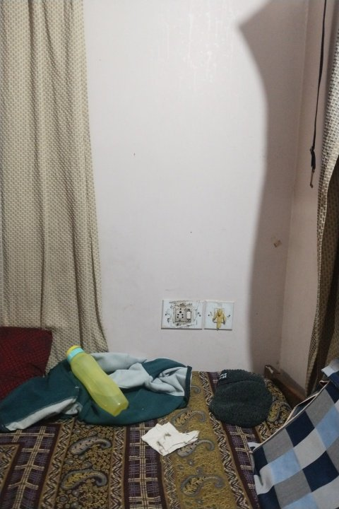
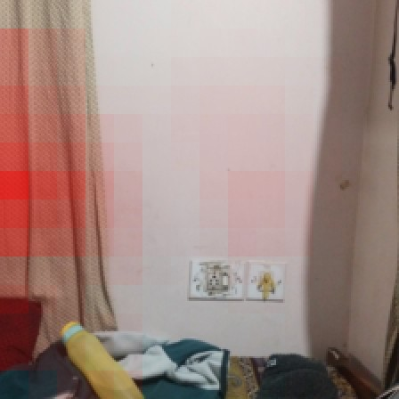
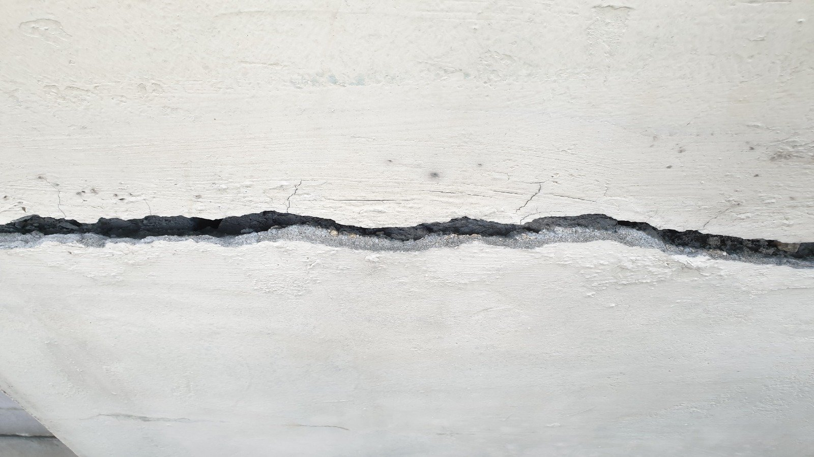
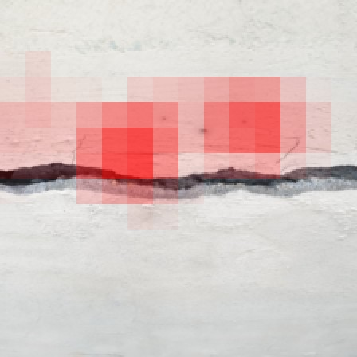

# Structural Vision AR — Model Development Report

*Building-inspection Android app: photograph a structural element → detect cracks
(segmentation) + classify the component type → risk score → AR overlay.*

Stack: Flutter + ARCore · FastAPI · Supabase · YOLOv8-seg (crack detection) +
MobileNetV3-Small (component classification) · ONNX.

---

## 1. System architecture

```
+--------------+   JWT-authed multipart    +------------------------------+
| Flutter app  | ------ POST /scan ------> | FastAPI backend              |
| (camera /    |                           |  +- Model 1: YOLOv8-seg      |
|  gallery)    | <----- poll /scan/{id} -- |  |   crack masks + area      |
|              |                           |  +- Model 2: MobileNetV3     |
| Result screen|                           |  |   component type          |
|  + AR view   | <-- /scan/{id}/overlay.glb|  +- Risk formula -> LOW/MED/HI
+--------------+                           +------------+-----------------+
                                                        |
                                           +------------v-------------+
                                           | Supabase                 |
                                           |  auth (JWT) . scans +    |
                                           |  crack_detections tables |
                                           |  . image storage bucket  |
                                           +--------------------------+
```

The scan is processed asynchronously: the app uploads the photo, the backend runs
both models in the background, and the app polls every 2 seconds until the result
is ready. Both models are loaded by file path, so a retrained model can be swapped
in by overwriting one file and restarting — zero code change.

---

## 2. Model 1 — Crack segmentation, version 1 (YOLOv8s-seg)

**Result: mask mAP50 = 0.69** on the crack.yolov8 validation set
(precision 0.74, recall 0.70).

The first version used YOLOv8**s**-seg (the small variant) trained at 640 px on a
single public crack dataset. It worked end-to-end and powered the first live
demos, but analysis showed it was **data-bound, not architecture-bound**: the
model had effectively learned everything the training set could teach it. The
errors were dominated by thin hairline cracks and low-contrast cracks — cases
that were under-represented (and sometimes unlabeled) in the training data.

**Thought process for overcoming this.** Since the ceiling was the data, not the
network, the retraining plan attacked the data axis first and the capacity axis
second:

1. **Merge multiple crack datasets** into one larger, more varied training set —
   more surfaces, lighting conditions, and crack widths.
2. **Train at higher resolution (1024 px)** so hairline cracks survive
   downscaling and remain learnable.
3. **Step up one model size** (YOLOv8s → YOLOv8m) so the extra data has enough
   capacity to be absorbed — but not so large that CPU inference breaks the
   app's < 3 s response budget.

## 3. Model 1 — Version 2 (YOLOv8m-seg, merged data, 1024 px training)

**Result at deployment settings (640 px, same 200-image validation set):**

| Metric          | v1 (YOLOv8s) | v2 (YOLOv8m) | Change |
|-----------------|--------------|--------------|--------|
| Mask mAP50      | 0.691        | **0.741**    | +0.05  |
| Mask precision  | 0.741        | **0.851**    | +0.11  |
| Mask recall     | 0.700        | 0.700        | ±0.00  |

Inference cost roughly doubled (~190 ms → ~390 ms per image on CPU), still well
inside the < 3 s budget. The old model is kept as a rollback
(`crack_seg_v1_backup.pt`).

**What the numbers tell us.** Precision jumped 11 points — the model almost never
hallucinates cracks now. But recall did not move: **the model still misses ~30 %
of cracks**, and that is what holds mAP at 0.74 against our 90 % target. A bigger
network on more data fixed the false-positive problem but not the false-negative
problem, which confirms the misses are concentrated in cases the training data
still doesn't represent well (hairline cracks, low contrast, unusual surfaces).

**What is necessary to go from 74 % → 90 %+** (in order of expected payoff):

1. **Targeted data collection.** Run the model over the validation set, inspect
   the false negatives, and label new images of exactly those failure patterns
   (thin cracks, low-contrast cracks, specific surface textures). Generic "more
   data" already gave its win; the next win is *targeted* data.
2. **Label audit.** Public crack datasets are noisy — images with real cracks
   left unlabeled actively teach the model to miss. Cleaning existing labels
   often beats adding new ones.
3. **Deploy at 1024 px instead of 640 px.** The model was *trained* at 1024;
   evaluating at 640 shrinks hairline cracks below detectability. This is a
   free experiment (config change, ~2–4× inference time, still within budget).
4. **Operating-point tuning.** With precision at 0.85 there is headroom to lower
   the confidence threshold and trade a little precision for recall.
5. **Last resorts:** YOLOv8l-seg, tiling large images into crops,
   test-time augmentation — each gives diminishing returns at real cost.

---

## 4. Model 2 — Component classification (MobileNetV3-Small)

**Result: 97 % validation accuracy** across 5 classes:
`beam · ceiling · column · slab · wall`.

**How it works.** The model is a convolutional neural network trained by
**transfer learning**: it starts pre-trained on ImageNet (1.4 M photos), already
knowing generic visual features, and is fine-tuned on our labeled dataset of
structural-element photos. It is exported to ONNX for fast CPU inference.

**How does it "know" an image is a wall vs. a ceiling?** CNNs build a feature
hierarchy, and the discriminative signal for each class lives at a different
level of it:

- **Early layers** detect edges, corners and material textures — concrete grain,
  brick lines, plaster.
- **Middle layers** compose these into shapes and orientations. This is where
  the classes separate: a **column** is a vertical elongated region of material
  with background on both sides; a **beam** is the horizontal counterpart, seen
  against a ceiling; a **ceiling** shot has upward perspective and a uniform
  surface; a **wall** is frontal and fills the frame; a **slab/floor** has
  downward perspective and floor-context objects.
- **The final layer** outputs 5 scores; a softmax turns them into probabilities.
  The highest probability is the prediction, and its value is the confidence
  shown in the app.

No rules are hand-coded — the network discovers these statistical visual
patterns from labeled examples during training. Its confidence output is
displayed in the app precisely because the model's certainty is informative.

### 4.1 Failure case — out-of-distribution input

A real scan from on-device testing: a bedroom wall photographed with furniture,
scattered objects and a screen partially covering the frame. The model predicted
**ceiling with 0.98 confidence** — confidently wrong.

| Scan photo | Where the model looked (occlusion heatmap) |
|---|---|
|  |  |

The heatmap (red = regions whose removal most reduces the "ceiling" score) shows
the model relied on the **plain, uniformly-lit upper surface region** — which
does resemble a ceiling — while the furniture and clutter that a human uses to
read "this is a room wall" contributed nothing toward the correct class.

**Why this happens.** The training data consists of deliberately framed photos
of structural elements. A cluttered domestic scene is **out-of-distribution
(OOD)**: nothing like it was seen in training, and neural networks are known to
be *overconfident* on OOD inputs — the softmax must put its probability mass
somewhere. This is a well-documented limitation of every deployed classifier,
not a defect specific to ours.

For contrast, the intended use case — the element framed to fill the shot —
classifies correctly with well-placed attention:

| Column scan (correct, 0.97) | Where the model looked |
|---|---|
|  |  |

**Mitigations.** (1) Usage guidance: frame the element to fill the shot, as an
inspector naturally would. (2) Longer term: augment training data with cluttered
real-world shots per class. The displayed confidence and this analysis are part
of the app's honest-failure story rather than something hidden.

---

## 5. Risk scoring

The risk level is computed from the segmentation output:

- **Crack area ratio** (total crack polygon area ÷ image area) drives severity.
- **Confidence** only escalates when the area is already substantial — high
  confidence on a tiny crack means "definitely a crack", not "dangerous".

| Level | Condition |
|---|---|
| HIGH | area ratio > 0.05, or > 0.03 with confidence > 0.85 |
| MEDIUM | area ratio > 0.01, or > 0.005 with confidence > 0.80 |
| LOW | otherwise |

The thresholds were tuned by validating against 40 crack-dataset images and
inspecting the resulting distribution. Note: the v2 model's higher recall on
small cracks pushes area ratios up, skewing the validation set toward MEDIUM
(174 of 200 images) — thresholds may deserve a re-tune after the next retrain.

---

## 6. AR — implemented and roadmap

### Implemented (verified on device, Vivo Y200)

- **Live AR session** (ARCore via `ar_flutter_plugin_2`): plane detection with a
  risk-colored info badge overlay.
- **Risk-colored 3D pin markers** — tap a detected plane to anchor a pin whose
  color matches the risk level (GLBs generated server-side, so marker changes
  need no app update).
- **Per-scan crack overlay (current highlight):** the backend renders each
  scan's detected crack polygons onto a transparent texture, builds a flat quad
  GLB on demand (`GET /scan/{id}/overlay.glb`), and the app projects it onto the
  tapped surface — the user sees the *actual crack pattern* on the wall in AR,
  not just a generic marker. Verified end-to-end on device.
- Robustness work from device testing: camera handover fix (ARCore crash),
  point-hit fallback for taps, release-build performance (~1 min plane
  detection vs. minutes in debug).

### Yet to be implemented

- **Multi-pin + labels** — one marker per crack with severity labels, instead of
  a single overlay quad.
- **True spatial registration** — automatically aligning the overlay with the
  real crack's position and scale (ARCore Augmented Images). The current overlay
  is placed where the user taps at a fixed 0.5 m size; true registration is
  future work as the Flutter AR plugin does not yet expose the API.
- **Vertical plane detection** — currently horizontal-only due to a
  device-specific ARCore crash; to be revisited after an ARCore update.
- **Physical crack measurement** — using AR plane geometry to estimate real
  crack dimensions in centimetres.
