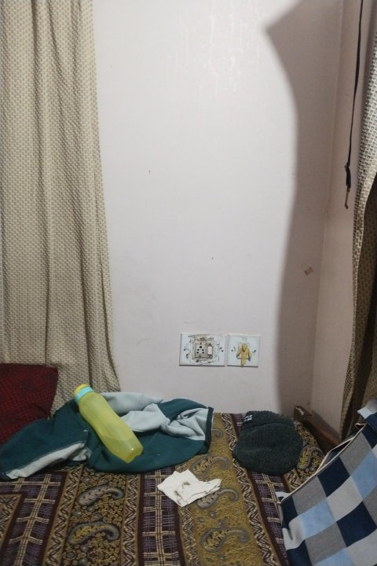
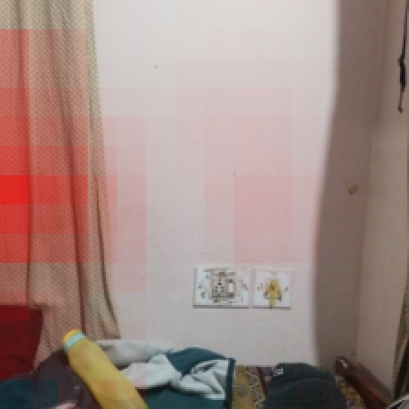
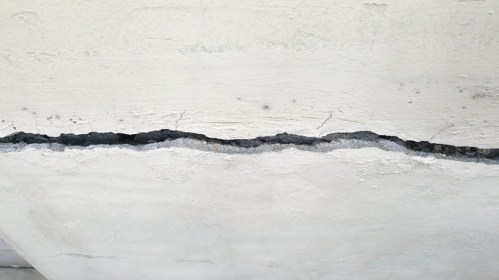
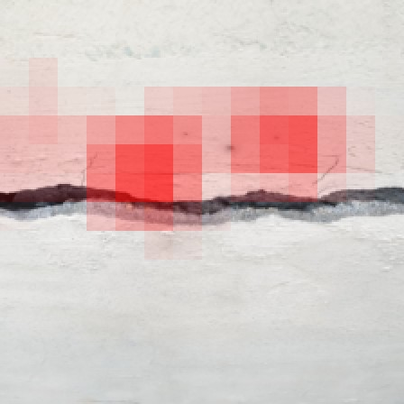

# Structural Vision AR — Model Development Report

*Building-inspection Android app: the user states the structural element, photographs
it → detect cracks (segmentation) → risk score → AR overlay → standards-based grade.*

Stack: Flutter + ARCore · FastAPI · Supabase · YOLOv8-seg (crack detection).

*Last updated 2026-09-16. Sections 5a, 6 and 7 supersede earlier drafts: the
component classifier was removed 2026-09-08, and the risk model was replaced by a
two-tier scheme.*

---

## 1. System architecture

```
+--------------+   JWT-authed multipart    +------------------------------+
| Flutter app  | ------ POST /scan ------> | FastAPI backend              |
| (camera /    |                           |  +- Model 1: YOLOv8-seg      |
|  gallery)    | <----- poll /scan/{id} -- |  |   crack masks + area      |
|              |                           |  +- Model 2: MobileNetV3     |
| Result screen|                           |  |   component type          |
|  + AR view   | <-- /scan/{id}/overlay.glb|  +- Risk formula -> LOW/MED/HI
+--------------+                           +------------+-----------------+
                                                        |
                                           +------------v-------------+
                                           | Supabase                 |
                                           |  auth (JWT) . scans +    |
                                           |  crack_detections tables |
                                           |  . image storage bucket  |
                                           +--------------------------+
```

The scan is processed asynchronously: the app uploads the photo, the backend runs
both models in the background, and the app polls every 2 seconds until the result
is ready. Both models are loaded by file path, so a retrained model can be swapped
in by overwriting one file and restarting — zero code change.

---

## 2. Model 1 — Crack segmentation, version 1 (YOLOv8s-seg)

**Result: mask mAP50 = 0.69** on the crack.yolov8 validation set
(precision 0.74, recall 0.70).

The first version used YOLOv8**s**-seg (the small variant) trained at 640 px on a
single public crack dataset. It worked end-to-end and powered the first live
demos, but analysis showed it was **data-bound, not architecture-bound**: the
model had effectively learned everything the training set could teach it. The
errors were dominated by thin hairline cracks and low-contrast cracks — cases
that were under-represented (and sometimes unlabeled) in the training data.

**Thought process for overcoming this.** Since the ceiling was the data, not the
network, the retraining plan attacked the data axis first and the capacity axis
second:

1. **Merge multiple crack datasets** into one larger, more varied training set —
   more surfaces, lighting conditions, and crack widths.
2. **Train at higher resolution (1024 px)** so hairline cracks survive
   downscaling and remain learnable.
3. **Step up one model size** (YOLOv8s → YOLOv8m) so the extra data has enough
   capacity to be absorbed — but not so large that CPU inference breaks the
   app's < 3 s response budget.

## 3. Model 1 — Version 2 (YOLOv8m-seg, merged data, 1024 px training)

**Result at deployment settings (640 px, same 200-image validation set):**

| Metric          | v1 (YOLOv8s) | v2 (YOLOv8m) | Change |
|-----------------|--------------|--------------|--------|
| Mask mAP50      | 0.691        | **0.741**    | +0.05  |
| Mask precision  | 0.741        | **0.851**    | +0.11  |
| Mask recall     | 0.700        | 0.700        | ±0.00  |

Inference cost roughly doubled (~190 ms → ~390 ms per image on CPU), still well
inside the < 3 s budget. The old model is kept as a rollback
(`crack_seg_v1_backup.pt`).

**What the numbers tell us.** Precision jumped 11 points — the model almost never
hallucinates cracks now. But recall did not move: **the model still misses ~30 %
of cracks**, and that is what holds mAP at 0.74 against our 90 % target. A bigger
network on more data fixed the false-positive problem but not the false-negative
problem, which confirms the misses are concentrated in cases the training data
still doesn't represent well (hairline cracks, low contrast, unusual surfaces).

**What is necessary to go from 74 % → 90 %+** (in order of expected payoff):

1. **Targeted data collection.** Run the model over the validation set, inspect
   the false negatives, and label new images of exactly those failure patterns
   (thin cracks, low-contrast cracks, specific surface textures). Generic "more
   data" already gave its win; the next win is *targeted* data.
2. **Label audit.** Public crack datasets are noisy — images with real cracks
   left unlabeled actively teach the model to miss. Cleaning existing labels
   often beats adding new ones.
3. **Deploy at 1024 px instead of 640 px.** The model was *trained* at 1024;
   evaluating at 640 shrinks hairline cracks below detectability. This is a
   free experiment (config change, ~2–4× inference time, still within budget).
4. **Operating-point tuning.** With precision at 0.85 there is headroom to lower
   the confidence threshold and trade a little precision for recall.
5. **Last resorts:** YOLOv8l-seg, tiling large images into crops,
   test-time augmentation — each gives diminishing returns at real cost.

---

## 3a. Version 3 (YOLOv8l-seg) — trained and rejected

Item 5 on the v2 list above ("last resorts: YOLOv8l-seg") was tried and did not pay.

| Metric | v2 (YOLOv8m) | v3 (YOLOv8l) |
|---|---|---|
| Mask mAP50 | 0.675 | 0.618 |
| CPU latency | ~1.0 s | ~4.3 s |

Rejected on both axes at once — less accurate *and* over four times slower, which
alone breaks the response budget. Two training sessions and ~35 GPU-hours went into
the v3 line, including a loss collapse to NaN that was never fully explained (the
ruled-out causes are a genuine methods note, not a failure to hide).

The conclusion drawn: **this problem was never architecture-bound.** Capacity had
already stopped being the constraint at v2.

## 3b. Version 4 (YOLOv8m-seg, 9,816 images) — deployed

Dataset expanded from ~3.5k to **9,816 training images** across five sources.

The decisive point is that v4 **lost on mask mAP50** (0.648 vs v2's 0.675) and was
still the right model to deploy, because mask mAP50 was the wrong yardstick. What
the app must get right is image-level: *is there a crack here, yes or no.* A mask
that traces a crack loosely still answers that correctly, and mAP punishes it.

Scored on 200 crack images + 200 SDNET2018 `Non-cracked` images, each image judged
by its highest-confidence detection:

| Model | conf | accuracy | cracks found | false alarms |
|---|---|---|---|---|
| v2 | 0.50 | 0.980 | 198/200 | 6/200 |
| **v4 (deployed)** | **0.40** | **0.990** | **199/200** | **3/200** |
| v4 | 0.25 | 0.985 | 199/200 | 6/200 |
| v2 | 0.25 | 0.960 | 197/200 | 16/200 |

Two further corrections followed from device data rather than benchmarks:

- **Duplicate masks.** v4 emitted a second mask over the same crack at bbox IoU
  0.49–0.62, doubling the area ratio and therefore the risk. Fixed by lowering NMS
  IoU from the 0.7 default to 0.45. Image-level accuracy is unaffected — the peak
  confidence per image does not change — but every area-derived number does.
- **Inference resolution.** 1024 / 1280 / 1600 px all score 199/200; 1600 adds a
  false alarm and costs 2.6× the latency. Deployed at 1024.

---

## 4. Model 2 — Component classification (MobileNetV3-Small), removed 2026-09-08

> **This model is no longer in the system.** The app now asks the user which
> component they are scanning *before* capture, and takes that as authoritative.
> Once the user states the component, a second guess at it has no job to do — and
> the classifier's own failure case below (§4.1) shows why a guess was a liability.
> The section is kept because the failure analysis is the useful part.


**Result: 97 % validation accuracy** across 5 classes:
`beam · ceiling · column · slab · wall`.

**How it works.** The model is a convolutional neural network trained by
**transfer learning**: it starts pre-trained on ImageNet (1.4 M photos), already
knowing generic visual features, and is fine-tuned on our labeled dataset of
structural-element photos. It is exported to ONNX for fast CPU inference.

**How does it "know" an image is a wall vs. a ceiling?** CNNs build a feature
hierarchy, and the discriminative signal for each class lives at a different
level of it:

- **Early layers** detect edges, corners and material textures — concrete grain,
  brick lines, plaster.
- **Middle layers** compose these into shapes and orientations. This is where
  the classes separate: a **column** is a vertical elongated region of material
  with background on both sides; a **beam** is the horizontal counterpart, seen
  against a ceiling; a **ceiling** shot has upward perspective and a uniform
  surface; a **wall** is frontal and fills the frame; a **slab/floor** has
  downward perspective and floor-context objects.
- **The final layer** outputs 5 scores; a softmax turns them into probabilities.
  The highest probability is the prediction, and its value is the confidence
  shown in the app.

No rules are hand-coded — the network discovers these statistical visual
patterns from labeled examples during training. Its confidence output is
displayed in the app precisely because the model's certainty is informative.

### 4.1 Failure case — out-of-distribution input

A real scan from on-device testing: a bedroom wall photographed with furniture,
scattered objects and a screen partially covering the frame. The model predicted
**ceiling with 0.98 confidence** — confidently wrong.

| Scan photo | Where the model looked (occlusion heatmap) |
|---|---|
|  |  |

The heatmap (red = regions whose removal most reduces the "ceiling" score) shows
the model relied on the **plain, uniformly-lit upper surface region** — which
does resemble a ceiling — while the furniture and clutter that a human uses to
read "this is a room wall" contributed nothing toward the correct class.

**Why this happens.** The training data consists of deliberately framed photos
of structural elements. A cluttered domestic scene is **out-of-distribution
(OOD)**: nothing like it was seen in training, and neural networks are known to
be *overconfident* on OOD inputs — the softmax must put its probability mass
somewhere. This is a well-documented limitation of every deployed classifier,
not a defect specific to ours.

For contrast, the intended use case — the element framed to fill the shot —
classifies correctly with well-placed attention:

| Column scan (correct, 0.97) | Where the model looked |
|---|---|
|  |  |

**Mitigations.** (1) Usage guidance: frame the element to fill the shot, as an
inspector naturally would. (2) Longer term: augment training data with cluttered
real-world shots per class. The displayed confidence and this analysis are part
of the app's honest-failure story rather than something hidden.

---

## 5. Risk scoring — two tiers

Risk is reported in two tiers, and the app is explicit about which one a given
result came from.

### Tier 1 — preliminary (scan time, no physical scale)

An in-house heuristic, **not** from any published standard: a damage index
`DI = crack_area_ratio x CF x SF`, graded HIGH at DI >= 0.07 and MEDIUM at >= 0.03.

- `CF` weights load-bearing members higher, following the JBDPA ordering
  (vertical load-bearing > horizontal > non-structural finishes): column and
  RC wall 1.5, beam 1.3, slab 1.0, masonry wall 0.8, ceiling 0.2.
- `SF` discounts cosmetic cracking: structural 1.0, paint/craze 0.2.

Thresholds were re-fit on 2026-09-15 from 0.10/0.25 to 0.03/0.07 — the old pair
had been fitted on double-counted duplicate masks (§3b), so removing the
duplicates required re-fitting the thresholds they had been tuned against.

**The honest limitation:** no published standard maps pixel area ratio to risk.
Every one of them grades physical crack *width*. Tier 1 exists only because it
needs nothing but the photo, and it is superseded the moment a width is measured.
It is also framing-dependent — the same crack photographed at three distances
graded LOW / MEDIUM / MEDIUM.

### Tier 2 — measured (after a physical length is supplied)

Once the user gives a real length — two taps in AR, or a tape reading typed in —
the photo acquires a scale and the crack width can be graded against published
standards:

- **RC members** (column, beam, slab, RC wall): the JBDPA post-earthquake damage
  guideline as published in Nakano, Maeda, Kuramoto & Murakami, *13WCEE* 2004,
  Paper 124. Table 2 maps residual crack width to damage class I–IV; Table 3 gives
  the capacity reduction factor per class and member type; the residual seismic
  capacity ratio R follows, rated Slight / Light / Moderate / Heavy.
- **Masonry walls**: BRE Digest 251 (rev. 1995), categories 0–5 by crack width.

## 5a. Why segmentation masks cannot measure hairline crack width

*Measured 2026-09-16. This is the most transferable finding in the project.*

The obvious way to get a crack's width is to divide its mask's pixel width by its
pixel length and scale by the measured physical length. It does not work, and the
failure is systematic rather than noisy.

On 2026-09-15 device testing, correct two-tap measurements produced absurd grades:
a hairline crack graded 5.5 mm and therefore HIGH. The measurements were blamed on
bad taps. They were not — both readings reproduce **exactly** from entirely
plausible tap distances (50 cm and 14.7 cm) using the stored mask widths.

The cause is architectural. YOLOv8-seg emits mask prototypes at `imgsz/4` and
upsamples them to the image, so the thinnest mask the network can draw is already
~10 image px on a 2560 px photo. Across real app scans, crack masks measured a
**median of 56 px wide**. On a 1.5 m hairline that is roughly **280× the true
width**. The mask is reporting its own granularity, not the crack.

**What works instead:** measure the crack from the photograph. Sampling intensity
profiles perpendicular to the crack's major axis and taking the median
full-width-half-minimum of the dark trough gives 4.0 px on a thin crack where the
mask says 23.8 px — validated against zoomed crops of the same crack.

**What it costs:** the trough method under-reads on broad spalled patches, where
half-minimum of a wide dark region falls inside the region. So neither estimator is
trustworthy alone. The system keeps both — the trough grades, the mask is the upper
bound — and when they disagree by more than 2× it reports a *range* with an
instruction to verify with a crack gauge, rather than a single number carrying
precision it does not have.

**The general lesson:** an instance-segmentation mask is a detection artifact, not a
measurement instrument. Its resolution floor is set by the network's prototype
stride, and any quantity derived by dividing mask dimensions inherits that floor.

## 5b. False-alarm filtering

Two false-alarm classes survived to the 2026-09-15 device test. Both were
characterised on 19 labelled non-crack photographs from that session:

| Filter | false alarms | cracks found |
|---|---|---|
| none | 2/19 | 13/13 |
| **minimum elongation >= 4 (deployed)** | **1/19** | **13/13** |
| mask fill of rotated rect <= 0.6 | 1/19 | 12/13 |
| tiled inference (full frame + 2×2) | 8/19 | 13/13 |

**Deployed: minimum elongation.** Cracks are long and thin; blobs are not. The
perforated-cabinet false alarm produced detections at elongation 1.1, 1.2 and 1.9,
while the thinnest real crack in the same session sat at 25.2 — over an order of
magnitude of separation, with the cutoff flat anywhere from 2 to 15. It costs
nothing measurable: 199/200 on the crack set and 0/200 on SDNET negatives, both
unchanged, and the demo-kit risk calibration is untouched.

**Rejected: the straight-edge filter.** On the same labelled set it cut false
alarms equally but lost a real crack.

**Rejected: tiled inference.** Tiling finds cracks the full-frame pass misses — on
one façade photograph it goes from 0 detections to catching the band crack at 0.77
confidence. But on the labelled negatives it *quadruples* false alarms while gaining
nothing, because the full-frame pass already found all 13 cracks. Six extra false
alarms to buy one crack is not a trade worth making.

**Still open: the overhead cable.** A cable strung across a wall is genuinely long
and thin (elongation 34.5) and no shape heuristic separates it from a crack. Width
variability along the detection does separate the one available example (1.46 vs
0.26–0.68 for cracks), but inspection shows this comes from the cable crossing
*background* rather than from the cable itself — a crack photographed across a
varied surface would score the same. With a single example and no defensible
mechanism, this is left unfiltered. It is a hard-negative training-data problem,
not a post-processing one.

## 6. AR — implemented and roadmap

### Implemented (verified on device, Vivo Y200)

- **Live AR session** (ARCore via `ar_flutter_plugin_2`): plane detection with a
  risk-colored info badge overlay.
- **Risk-colored 3D pin markers** — tap a detected plane to anchor a pin whose
  color matches the risk level (GLBs generated server-side, so marker changes
  need no app update).
- **Per-scan crack overlay (current highlight):** the backend renders each
  scan's detected crack polygons onto a transparent texture, builds a flat quad
  GLB on demand (`GET /scan/{id}/overlay.glb`), and the app projects it onto the
  tapped surface — the user sees the *actual crack pattern* on the wall in AR,
  not just a generic marker. Verified end-to-end on device.
- Robustness work from device testing: camera handover fix (ARCore crash),
  point-hit fallback for taps, release-build performance (~1 min plane
  detection vs. minutes in debug).

### Yet to be implemented

- **Multi-pin + labels** — one marker per crack with severity labels, instead of
  a single overlay quad.
- **True spatial registration** — automatically aligning the overlay with the real
  crack's position and scale (ARCore Augmented Images). The current overlay is
  placed where the user taps at a fixed 1.0 m size; the Flutter AR plugin does not
  expose the API.

### Corrections to earlier drafts (2026-09-16)

- **"Horizontal-only" was a caption problem, not a capability one.** ARCore reports
  desks, tables, floors, slabs and ceilings all as horizontal planes, so the
  horizontal configuration always covered every flat surface. Only the on-screen
  copy said "floor", which made the system look floor-restricted in demonstration.
- **Vertical planes** genuinely do crash (SIGSEGV in `libarcore_c.so`) on the test
  device. Since a native crash cannot be caught in Dart, the feature ships as an
  opt-in behind a persistence guard: a flag is written before switching and cleared
  once the session survives; finding it still set at next launch proves the process
  died there, and the option is withdrawn permanently on that device. Hardware that
  supports vertical planes keeps the feature.
- **Physical crack measurement is implemented**, in both routes — two-tap AR for
  horizontal surfaces, and typed tape entry for walls, columns and beams, both
  posting to the same grading endpoint. A measurement is rejected when the implied
  frame size falls outside 5 cm – 15 m, which catches taps landing on a surface
  behind the crack. See §5a for why the width it produces is reported as a bounded
  range rather than a single figure.
- **Capture resolution.** `ResolutionPreset.high` is 1280×720, not 1080p; every
  stored scan from the 2026-09-15 session came back 720×1280, meaning photographs
  were being *upscaled* to the 1024 px inference size. Raised to 1920×1080.

---

## 7. Summary — what the evidence actually supports

1. The problem was **data-bound, then metric-bound, and never architecture-bound.**
   A larger network (v3) was worse and slower; the model that lost on mask mAP50
   (v4) was the one worth deploying, because mAP50 was measuring the wrong thing.
2. **Instance-segmentation masks are detection artifacts, not measurement
   instruments** (§5a). Any physical quantity derived by dividing mask dimensions
   inherits the network's prototype-stride resolution floor. This was reached by
   reproducing a field bug arithmetically rather than by trusting its first
   diagnosis.
3. **Field photographs disagree with benchmarks about what is hard.** SDNET
   negatives are plain concrete; real false alarms were curtain folds, bag seams,
   television edges, perforated cabinet panels and overhead cables. Every filtering
   decision in §5b was made on labelled device photographs, and the benchmarks
   served only to confirm nothing regressed.
4. **Some failures are honestly out of reach** of post-processing. The cable false
   alarm needs hard negatives in training, and saying so is more useful than
   shipping a heuristic fitted to one example.
